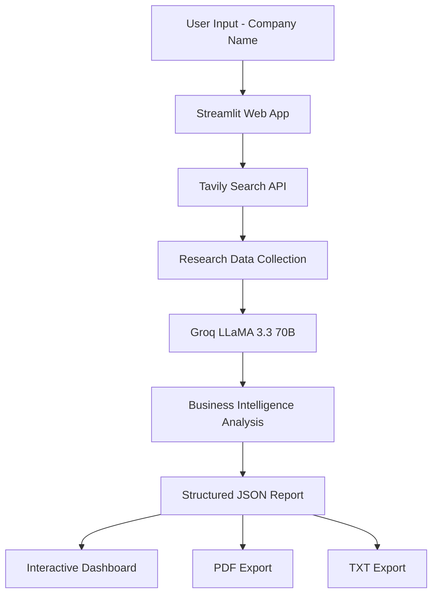
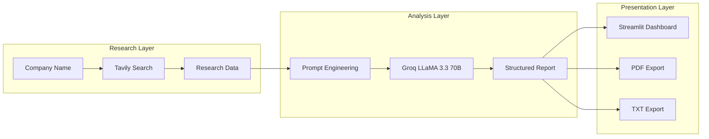

# 🏢 Company Intelligence Agent

Built an AI-powered business research platform that gathers real-time company information, analyzes it using LLMs, and generates structured intelligence reports. Implemented with Python, Streamlit, Tavily Search API, and Groq LLaMA 3.3 70B, including PDF export and interactive report visualization.

---

## 🎯 What Does This Do?

You type a company name.

The agent:
1. Searches the internet for real, current information about that company
2. Sends the research to an AI model for deep analysis
3. Generates a structured 5-section intelligence report
4. Presents it in a clean web interface
5. Lets you download the report as PDF or TXT

**Input:** Any company name (e.g. "Adani Realty")

**Output:** A professional intelligence report covering:
- Company Overview
- Key Business Information
- Business Challenges
- AI Opportunities
- Personalized CEO Pitch

---

## 🏗️ System Architecture



**Data Flow:**
1. User types company name → Streamlit captures input
2. `search_tool.py` queries Tavily API with 3 targeted searches
3. Raw search results passed to `analyst.py`
4. `analyst.py` formats research + sends to Groq LLaMA 3.3 70B
5. Groq returns structured JSON report
6. Streamlit renders each section as styled cards
7. `pdf_export.py` converts report to downloadable PDF

--- 
## 🔄 Architecture Overview



## ⚡ Quick Start

### 1. Clone the repository
```bash
git clone https://github.com/YOUR_USERNAME/unada-research-agent.git
cd unada-research-agent
```

### 2. Create and activate virtual environment
```bash
# Create
python -m venv venv

# Activate (Windows)
venv\Scripts\activate

# Activate (Mac/Linux)
source venv/bin/activate
```

### 3. Install dependencies
```bash
pip install -r requirements.txt
```

### 4. Set up API keys
```bash
# Copy the example env file
cp .env.example .env

# Open .env and add your actual keys
```

Your `.env` file should look like:
TAVILY_API_KEY=tvly-your-key-here
GROQ_API_KEY=gsk_your-key-here

### 5. Run the application
```bash
streamlit run app/streamlit_app.py
```

Open your browser at `http://localhost:8501`

---

## 🔑 API Keys Required

| Service | Purpose | Cost | Get It |
|---------|---------|------|--------|
| Tavily | Real-time web search | Free (1000/month) | [tavily.com](https://tavily.com) |
| Groq | LLM inference (LLaMA 3.3 70B) | Free tier | [console.groq.com](https://console.groq.com) |

**Total cost to run this project: $0**

---

## 📁 Project Structure

```text
company-intelligence-agent/
│
├── app/
│   └── streamlit_app.py
│
├── src/
│   ├── agents/
│   │   └── analyst.py
│   │
│   ├── tools/
│   │   ├── search_tool.py
│   │   └── pdf_export.py
│   │
│   └── prompts/
│       └── report_prompts.py
│
├── outputs/
│   └── generated_reports/
│
├── docs/
│   ├── architecture.png
│   └── screenshots/
│
├── .env.example
├── requirements.txt
├── README.md
└── .gitignore
```
## 🧠 Technical Decisions & Reasoning

### Why Groq + LLaMA 3.3 70B instead of GPT-4?
Groq provides free, extremely fast inference for LLaMA 3.3 70B — a model 
that matches GPT-4 quality on reasoning tasks. For a production system, 
the architecture supports swapping any OpenAI-compatible model in one line.

### Why Tavily instead of web scraping?
Tavily is purpose-built for AI agents — it returns clean, structured 
results without the fragility of scraping (bot detection, HTML parsing, 
rate limiting). It also provides relevance scoring built-in.

### Why Streamlit instead of Flask/React?
The assignment prioritizes reasoning and AI quality over frontend 
engineering. Streamlit delivers a professional interface in pure Python, 
allowing maximum time investment in the agent logic and prompt quality.

### Why separate prompts file?
Prompt engineering is iterative. Keeping prompts in a dedicated file 
means you can improve output quality without touching business logic — 
a production best practice used by teams at Anthropic and OpenAI.

### Why structured JSON output from the LLM?
Structured output means each report section can be displayed, styled, 
and exported independently. It also makes the system extensible — 
adding a new section requires changing only the prompt and UI, 
not the entire pipeline.

---

## 🧪 Testing the Agent

Test with these companies to verify quality:

```bash
# Run the analyst directly (no UI)
python -m src.agents.analyst
```

**Recommended test companies:**
- `Adani Realty` — Large conglomerate, lots of data
- `Sobha Limited` — Mid-size, Bangalore-based
- `Prestige Group` — South India focused
- `DLF Limited` — North India, good for variety
- `Puravankara` — Smaller, tests low-data handling

---

## ⚠️ Known Limitations

| Limitation | Impact | Future Fix |
|-----------|--------|------------|
| Small/private companies have limited web data | Thinner reports | Add LinkedIn + company website scraping |
| Groq free tier: 30 req/min | Slight delay if many users | Add request queuing + caching |
| Report quality depends on search result quality | Occasional gaps | Add multiple search providers as fallback |
| No conversation history | Each report is independent | Add session state for follow-up questions |

---

## 🔮 Future Improvements

- [ ] **Competitor comparison** — Generate side-by-side reports for 2 companies
- [ ] **Export to PPTX** — Auto-generate a pitch deck from the report  
- [ ] **Report history** — Save and browse previously generated reports
- [ ] **Email delivery** — Send report directly to user's email
- [ ] **Confidence scoring** — Rate how much web data was found per section

---

## 📊 Evaluation Criteria Mapping

| Assignment Criterion | Weight | How This Project Addresses It |
|----------------------|--------|-------------------------------|
| Problem Solving & Reasoning | 30% | Multi-query search strategy + chain-of-thought prompting with explicit reasoning instructions |
| Quality of Research | 20% | Real-time Tavily search with 3 targeted queries per company |
| Practicality of Recommendations | 20% | Prompts explicitly reject generic suggestions; force company-specific AI opportunities |
| AI Tool Usage | 15% | Groq LLaMA 3.3 70B + Tavily + Streamlit — full AI stack |
| Product Quality | 10% | Professional dark-theme UI, PDF export, error handling |
| Documentation & Communication | 5% | This README + inline code comments + architecture diagram |

---
